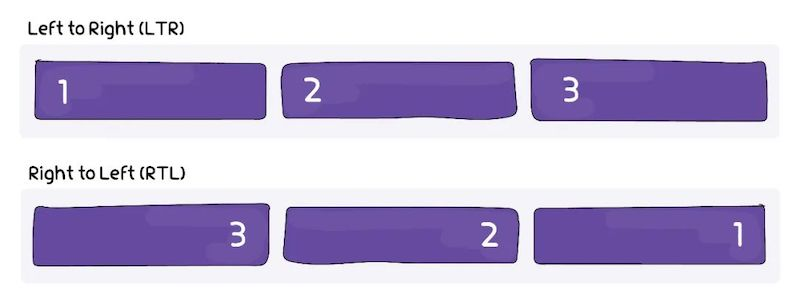
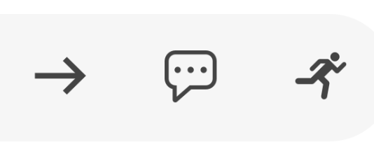
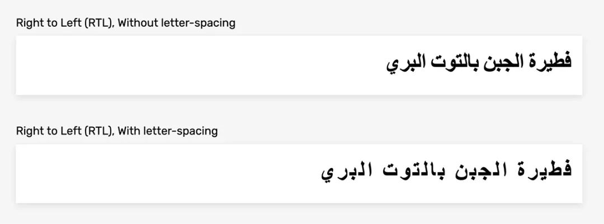
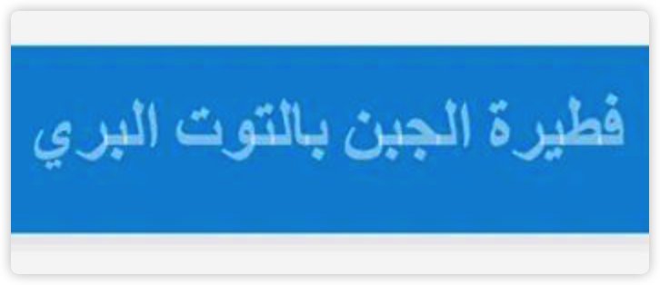
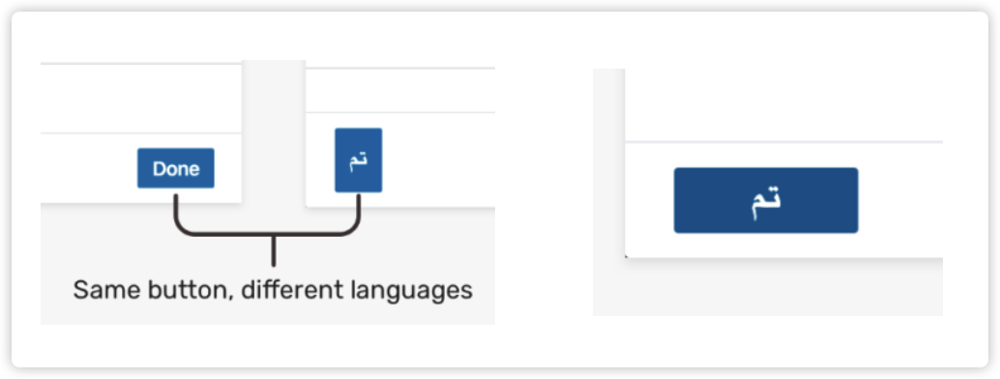
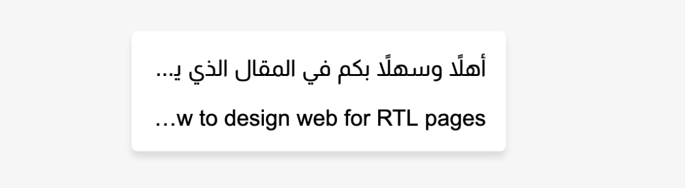

# RTL 适配

分享者：齐云江

---

# 目录

- 前言
- 原理
- 常见问题
- 错误展示
- CSS 逻辑属性
- 自动化工具

---

# 前言

RTL(Right-To-Left)语言，故名思义，从右往左写的语言。我们的官网支持两种 RTL 语言，分别是“阿拉伯语”和“乌尔都语”。在我们开发的项目需要支持这两种语言时，就需要进行一下 RTL 适配

---

# 原理

---

## dir

当我们识别到当前用户的语言是 RTL 语言时，修改 html 标签的`dir`属性为`rtl`即可。
https://developer.mozilla.org/zh-CN/docs/Web/HTML/Global_attributes/dir

```html
<html dir="rtl">
  ...
</html>
```

---

## direction

CSS 属性，可以设置文本排列的基本方向，用来适配局部文本的方向。
全局的文本方向还是建议使用 html 的`dir`属性。
https://developer.mozilla.org/zh-CN/docs/Web/CSS/direction

---

## writing-mode

CSS 属性，的默认值为`horizontal-tb`，及文字水平排列，从上到下换行。
“Table”、“Flexbox”和“Grid”都是基于`writing-mode`的，能够根据`direction`的值自动翻转。
https://developer.mozilla.org/zh-CN/docs/Web/API/HTMLElement/dir



---

## 翻转带方向性的 Icon

有一些 Icon 有方向，同时需要跟阅读方向一致，需要翻转，可以使用`transform: rotateY(180deg);`或者`transform: scaleX(-1);`。



另外有一些 Icon 有方向，但只跟惯用手有关，不需要翻转。

---

## 排版符号

左至右符号（Left-to-right mark, LRM）`&lrm;`和右至左符号（Right-to-left mark, RLM）`&rlm;`，是不可见的排版符号，一般在双向文稿中使用，可以在不增加 html 标签层级的情况下解决局部文字排版问题。不直观，不建议使用。

---

# 常见错误

---

## letter-spacing

RTL 语言字母不应该断开，所以`letter-spacing`应设置为`0`。


---

## 文本颜色透明度

RTL 语言文本颜色不要有透明度，否则会出现渲染问题。


---

## 单词长度问题

在一些按钮上，不同的语言，文字长度不一样，可以设置`min-width`保证按钮的美观。


---

## 文字溢出

文字溢出的方向有时不对，可以在标签上加`dir="auto"`解决。


---

# 错误展示

---

# CSS 逻辑属性

https://developer.mozilla.org/zh-CN/docs/Web/CSS/CSS_logical_properties_and_values

```css
/* before */
.icon {
  margin-right: 10px;
  [dir="rtl"] & {
    margin-right: 0;
    margin-left: 10px;
  }
}
/* after */
.icon {
  margin-inline-end: 10px;
}
```

---

# 自动化工具

1. Bi-App-Sass  
   https://anasnakawa.github.io/bi-app-sass/
2. RTLCSS  
   https://rtlcss.com/
3. stylis-rtl  
   https://github.com/FindHotel/stylis-rtl
   https://emotion.sh/docs/@emotion/cache#stylisplugins

---

# 参考链接

1. https://mp.weixin.qq.com/s/a2UfKhOAIwAcxKp2n5-OPg

2. https://rtlstyling.com/posts/rtl-styling/#basic-example-of-flipping-a-design

---

# THANKS
