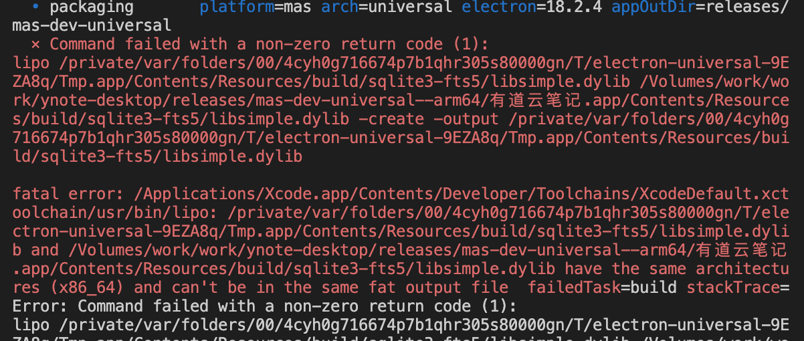
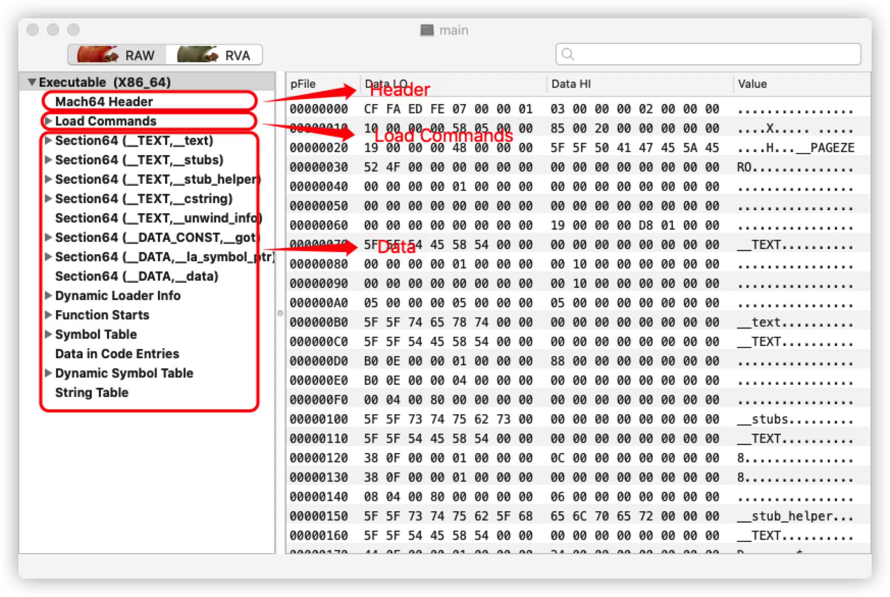
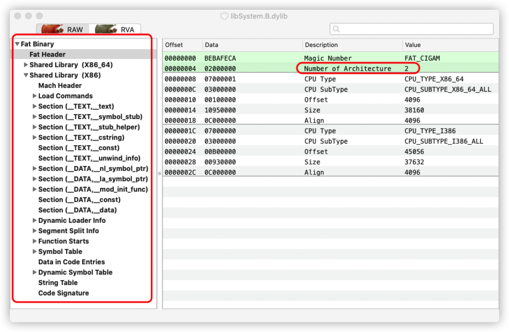

# M1 芯片打包适配

## WHY

距离 2020 年 11 月 11 日 苹果 M1 芯片发布，已经一年多，目前 Mac 平台我们只发布了 x64 的版本，用户在 M1 的 MacOS 上运行 x64 的版本时系统会自动使用 Rosetta 2 转译后运行，即使已经优化的很好，但是还是有很大的性能损耗。

## M1 打包

electron-builder --mac

## 启动时间测试

### 测试平台

**MacBook Pro Intel 2020**  
CPU Intel i7  
内存 16 GB

**MacBook Pro Apple 2020**  
CPU Apple M1  
内存 16 GB

### 启动时间统计

- 表格
  https://office.netease.com/sheet/?identity=d258a531cb464bd48c3a65561dd00daa&source=LX&tab=0
- 总结
  https://office.netease.com/doc/?identity=69a0e8a0338744bd94a6d2705ff0b38d&source=LX

### 对比结果

- M1 机器运行 arm64 包对比 Intel 机器运行 x64 包快 37.75%；
- M1 机器运行 arm64 包对比 M1 机器运行 x64 包快 113.10%；
- M1 机器运行 x64 包冷启动需要转译，会花费 11 秒左右；
- M1 机器运行 arm64 包冷启动对比 M1 机器运行 x64 包冷启动快 227.68%。

## 通用包打包

electron-builder --universal --mac mas



### 调研

#### electron-builder

[macPackager->doPack](https://github.com/electron-userland/electron-builder/blob/master/packages/app-builder-lib/src/macPackager.ts#L106)

macPackager 的 doPack 在打通用包时，调用 super.doPack 也就是 platformPackager 的 doPack 分别生成了 x64 和 arm64 两种架构的文件夹，然后使用 @electron/universal 进行合并操作。

```js
case Arch.universal: {
  const x64Arch = Arch.x64
  const x64AppOutDir = appOutDir + "--" + Arch[x64Arch]
  await super.doPack(outDir, x64AppOutDir, platformName, x64Arch, platformSpecificBuildOptions, targets, false, true)
  const arm64Arch = Arch.arm64
  const arm64AppOutPath = appOutDir + "--" + Arch[arm64Arch]
  await super.doPack(outDir, arm64AppOutPath, platformName, arm64Arch, platformSpecificBuildOptions, targets, false, true)
  const framework = this.info.framework
  log.info(
    {
      platform: platformName,
      arch: Arch[arch],
      [`${framework.name}`]: framework.version,
      appOutDir: log.filePath(appOutDir),
    },
    `packaging`
  )
  const appFile = `${this.appInfo.productFilename}.app`
  const { makeUniversalApp } = require("@electron/universal")
  await makeUniversalApp({
    x64AppPath: path.join(x64AppOutDir, appFile),
    arm64AppPath: path.join(arm64AppOutPath, appFile),
    outAppPath: path.join(appOutDir, appFile),
    force: true,
    mergeASARs: platformSpecificBuildOptions.mergeASARs ?? true,
    singleArchFiles: platformSpecificBuildOptions.singleArchFiles,
    x64ArchFiles: platformSpecificBuildOptions.x64ArchFiles,
  })
  await fs.rm(x64AppOutDir, { recursive: true, force: true })
  await fs.rm(arm64AppOutPath, { recursive: true, force: true })

  // Give users a final opportunity to perform things on the combined universal package before signing
  const packContext: AfterPackContext = {
    appOutDir,
    outDir,
    arch,
    targets,
    packager: this,
    electronPlatformName: platformName,
  }
  await this.info.afterPack(packContext)

  await this.doSignAfterPack(outDir, appOutDir, platformName, arch, platformSpecificBuildOptions, targets)
  break
}
```

[platformPackager->doPack](https://github.com/electron-userland/electron-builder/blob/master/packages/app-builder-lib/src/platformPackager.ts#L307)

`afterPack` 是我们成功的关键点

```js
if (framework.afterPack != null) {
  await framework.afterPack(packContext);
}
```

@electron/universal  
@electron/universal 会比对两个架构的文件夹里的文件，使用 file 命令获取文件类型，判断是否是 Mach-O 文件还是其他的文件，对 Mach-O 文件会调用 lipo 命令合并成通用二进制格式，其他文件也会根据规则进行合并操作。然后产生 app 文件夹，继续进行后续的操作。

file 命令 [获取文件类型](https://github.com/electron/universal/blob/master/src/file-utils.ts#L40)

```
fileOutput = await spawn('file', ['--brief', '--no-pad', filePath]);
```

Mach-O 文件 [苹果的二进制文件格式](https://geneblue.github.io/2021/01/04/osx/sec--MachO-file-format/)

二进制文件格式


通用二进制格式


lipo 命令 [合并通用二进制格式](https://github.com/electron/universal/blob/master/src/index.ts#L163)

```
await spawn('lipo', [ first, second, '-create', '-output', outputPath ]);
```

### 方案

先打一个 arm64 的包，然后在 x64 环境下打通用包，在 arm64 的 afterPack 脚本中替换 Mach-O 文件，以便 `@electron/universal` 合并成通用二进制格式。

### 还有问题

启动时出现无法加载 dylib 文件的问题。

首先通过 file 命令，判断 dylib 大概率没有问题。

然后比对准备用来合并的两个文件夹里的 .node 文件，发现 `ref-napi` 有些问题，arm64 的有 `build/Release/binding.node`，x64 的却没有，而是用的 prebuilds 里的 .node 文件 `prebuilds/darwin-x64/electron.napi.node`，合并之后都会优先加载前者，前者又是单 arm64 的，导致在 x64 平台上加载失败。

最后分析下来，最好是在 x64 平台编译一个 `build/Release/binding.node`，和 arm64 的合并成通用二进制文件，这样就都可以加载到了。

```
rimraf node_modules/ref-napi/prebuilds && electron-builder install-app-deps
```

## 其他问题

- 安装 arm64 版的 Node.js
  Node.js 从 15.3.x 开始支持 arm64，可以使用 nvm 可以安装 15.3.x 以上版本，或从官网下载安装包进行安装。
- 如何判断 M1 机型运行了 x64 的包  
  ```
  uname -a
  ```
  - M1 运行 arm64 包
    Darwin qiyunjiang.local 20.6.0 Darwin Kernel Version 20.6.0: Mon Aug 30 06:12:21 PDT 2021; root:xnu-7195.141.6~3/RELEASE\_**ARM64**\_T8101 **arm64**
  - M1 运行 x64 包
    Darwin qiyunjiang.local 20.6.0 Darwin Kernel Version 20.6.0: Mon Aug 30 06:12:21 PDT 2021; root:xnu-7195.141.6~3/RELEASE\_**ARM64**\_T8101 **x86_64**

## 总结

Electron 打包过程中还遇到过很多很多的问题，通过不断去 Google、去 Github 上搜 issue，看源码，冷静分析和耐心尝试之后，一定可以找到那个最适合的答案。

## THANKS
