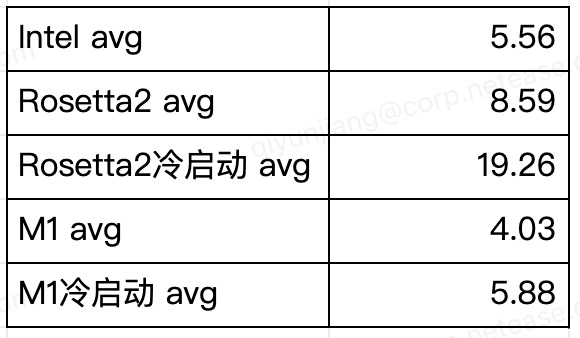

# M1 芯片打包适配

分享者：齐云江

---

# WHY

距离 2020 年 11 月 11 日 M1 发布，已经一年多，目前 Mac 平台我们只发布了 x64 的包，用户在 M1 的 Mac 上运行 x64 的包时系统会自动使用 Rosetta 2 转译后运行，即使已经优化的很好，但是还是有很大的性能损耗。

---

# M1 打包

M1 的指令集采用的 arm64，不过我们不需要任何适配，使用 x64 包同样的命令即可打出 M1 包。
需要注意的是，Node.js 从 15.3.x 开始支持 arm64，使用 nvm 可以安装 15.3.x 以上版本，或从官网下载安装包进行安装。

---

# 启动时间测试

## 测试平台

**Intel**
系统 11.6
CPU Intel 四核 i7 2.3 GHz
内存 16 GB

**Apple**
系统 12.3.1
CPU Apple M1
内存 16 GB

---

# 启动时间统计

每个情况测10次计算平均值

从开始运行程序，到页面渲染完成花费的时间（秒）

---

# 对比结果

- M1机器运行arm64包对比Intel机器运行x64包快37.75%
- M1机器运行arm64包对比M1机器运行x64包快113.10%
- M1机器运行x64包冷启动需要转译，会花费11秒左右
- M1机器运行arm64包冷启动对比M1机器运行x64包冷启动快227.68%

---

# 通用包打包

1. @electron/universal
2. electron-builder --universal

---

# 调研

@electron/universal 源码阅读
electron-builder 源码阅读
Mach-O 文件格式
lipo 命令
file 命令

---

# THANKS

