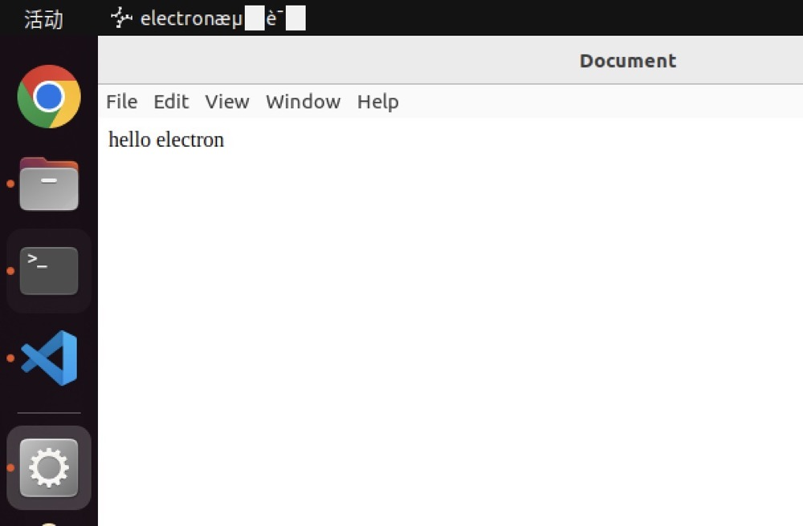
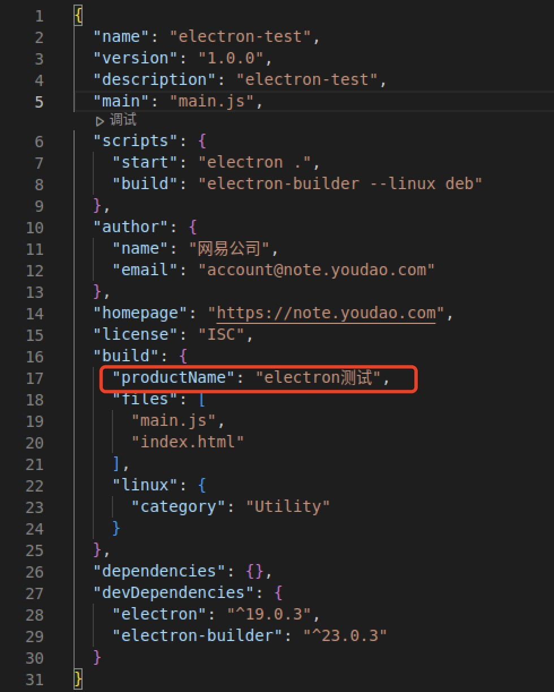
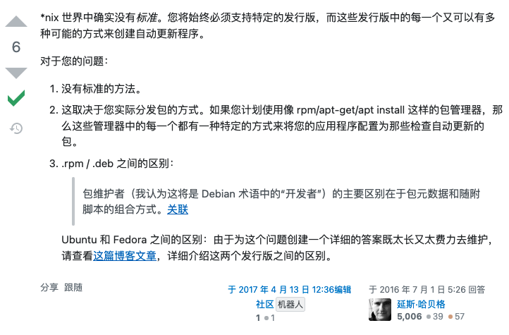

# Linux 打包适配

## WHY

Linux 桌面操作系统的用户越来越多，一部分是使用 Debian、Ubuntu 的开发者、科研人员、爱好者等；另一部分是使用麒麟 OS 和 UOS 这些国产操作系统的党政、国防、教育等领域的用户。支持 Linux 系统可以扩大用户群并提升我们的影响力。

云笔记基于 Electron 开发，而 Electron 就支持 Linux 打包，所以可以直接复用现有的代码，只需要进行一些打包适配。

## deb 打包

electron-builder --linux deb

出现文字和 icon 显示问题


把 productName 字段从 package.json 的最外层移到 electron-builder 的配置中。


## 自动升级

1. 为什么 electron-updater 不支持 deb 的自动升级；[why？](https://stackoverflow.com/a/38137655)



linux 版的 VSCode、Chrome 等应用也是检查到更新后，引导用户去官网下载并重装。所以我们目标是实现同样的效果。

2. 自主开发脚本生成 deb 包的 latest-linux.yml；[e.g.](https://g.hz.netease.com/cowork/web/ynote/ynote-desktop/-/blob/develop/scripts/updateinfo-deb.js)

```js
const yaml = require("js-yaml");
const fs = require("fs-extra");
const path = require("path");

const cwd = process.cwd();

const dist = "releases";

const getVersion = async () => {
  return (await fs.readJson(path.join(cwd, "package.json"))).version;
};

const getReleaseNotes = async () => {
  return fs.readFile(path.join(cwd, "release-notes.md"), "utf-8");
};

const writeLatestYml = async (updateInfo) => {
  const filePath = path.join(cwd, dist, "latest-linux.yml");
  await fs.ensureFile(filePath);
  return fs.writeFile(filePath, yaml.safeDump(updateInfo), "utf-8");
};

const main = async () => {
  const version = await getVersion();
  const releaseNotes = await getReleaseNotes();
  const releaseDate = new Date().toISOString();
  await writeLatestYml({
    version,
    releaseNotes,
    releaseDate,
  });
};

main();
```

3. 模仿 electron-updater 的 [API](https://github.com/electron-userland/electron-builder/blob/master/packages/electron-updater/src/AppUpdater.ts#L33) 开发一个 linux-updater，整合到自动升级流程；electron-updater 包含了检查更新、下载更新、安装更新等功能；我们简化了下载和重装，只保留检查更新功能即可([e.g.](https://g.hz.netease.com/cowork/web/ynote/ynote-desktop/-/blob/develop/src/shared/linux-updater.ts))。

## arm64 适配

- fpm 问题，electron-builder 使用 fpm 进行打包，但是没有 arm64 架构的包，下载的是 x86 的包 [issue](https://github.com/electron-userland/electron-builder/issues/5154)

```
  • downloading     url=https://github.com/electron-userland/electron-builder-binaries/releases/download/fpm-1.9.3-2.3.1-linux-x86/fpm-1.9.3-2.3.1-linux-x86.7z size=4.6 MB parts=1
  • downloaded      url=https://github.com/electron-userland/electron-builder-binaries/releases/download/fpm-1.9.3-2.3.1-linux-x86/fpm-1.9.3-2.3.1-linux-x86.7z duration=3.13s
  ⨯ cannot execute  cause=exit status 127
                    errorOut=/home/node/.cache/electron-builder/fpm/fpm-1.9.3-2.3.1-linux-x86/lib/ruby/bin/ruby: line 6: /home/node/.cache/electron-builder/fpm/fpm-1.9.3-2.3.1-linux-x86/lib/ruby/bin.real/ruby: No such file or directory

                    command=/home/node/.cache/electron-builder/fpm/fpm-1.9.3-2.3.1-linux-x86/fpm -s dir --force -t deb -d libgtk-3-0 -d libnotify4 -d libnss3 -d libxss1 -d libxtst6 -d xdg-utils -d libatspi2.0-0 -d libuuid1 -d libappindicator3-1 -d libsecret-1-0 --deb-compression xz --architecture armhf --name bridgecmdr --after-install /tmp/t-ufb98R/0-after-install --after-remove /tmp/t-ufb98R/1-after-remove --description
```

解决

```
sudo apt-get install ruby-full
sudo gem install fpm
```

```
USE_SYSTEM_FPM=true electron-builder --arm64 --linux deb
```

## UOS 打包

UOS（Debian 的衍生发行版）因系统经过高度定制，因此支持自有打包方案。

1. 安装依赖
2. 结构创建
3. 打包构建

依赖安装

```
sudo apt install dh-make fakeroot build-essential
```

结构创建

我们可以根据打包[教程](https://www.vvave.net/archives/how-to-build-a-debian-series-distros-installation-package.html)，编写自动化[脚本](https://g.hz.netease.com/cowork/web/ynote/ynote-desktop/-/blob/develop/scripts/rebuild-uos.js)，自动化结构创建。

```
com.netease.youdaonote-7.1.0
├── com.netease.youdaonote
│   ├── entries
│   │   ├── applications
│   │   │   └── com.netease.youdaonote.desktop
│   │   └── icons
│   │       └── hicolor
│   │           ├── 16x16
│   │           │   └── apps
│   │           │       └── com.netease.youdaonote.png
│   │           ├── 24x24
│   │           │   └── apps
│   │           │       └── com.netease.youdaonote.png
│   │           ├── 32x32
│   │           │   └── apps
│   │           │       └── com.netease.youdaonote.png
│   │           ├── 48x48
│   │           │   └── apps
│   │           │       └── com.netease.youdaonote.png
│   │           ├── 128x128
│   │           │   └── apps
│   │           │       └── com.netease.youdaonote.png
│   │           ├── 256x256
│   │           │   └── apps
│   │           │       └── com.netease.youdaonote.png
│   │           ├── 512x512
│   │           │   └── apps
│   │           │       └── com.netease.youdaonote.png
│   │           └── scalable
│   │               └── apps
│   │                   └── com.netease.youdaonote.svg
│   ├── files
│   └── info
└── debian
    ├── changelog
    ├── control
    ├── copyright
    ├── install
    ├── postinst
    ├── rules
    └── source
```

打包命令

```
USE_SYSTEM_FPM=true electron-builder --dir --arm64 --linux
node scripts/rebuild-uos.js
```

## 其他问题

- 运行报错：Running as root without --no-sandbox is not supported

由于使用 root 权限运行，所以不能使用沙盒模式，在 electron-builder 的配置里加入：

```
"executableArgs": [ "--no-sandbox" ]
```

- Gitlab-ci 里 npm install 权限问题

```
npm set unsafe-perm true
```

- Electron 镜像加速

```
export ELECTRON_MIRROR=https://npmmirror.com/mirrors/electron/
export ELECTRON_BUILDER_BINARIES_MIRROR=https://npmmirror.com/mirrors/electron-builder-binaries/
```

- arm64 麒麟 OS 安装后，创建快捷方式，图标不显示

可以使用绝对路径解决，在 electron-builder 的配置里加入：

```
"desktop": { Icon: "/opt/有道云笔记/resources/build/icon.svg" }
```

## 总结

Electron 打包过程中还遇到过很多很多的问题，通过不断去 Google、去 Github 上搜 issue，看源码，冷静分析和耐心尝试之后，一定可以找到那个最适合的答案。

## THANKS
