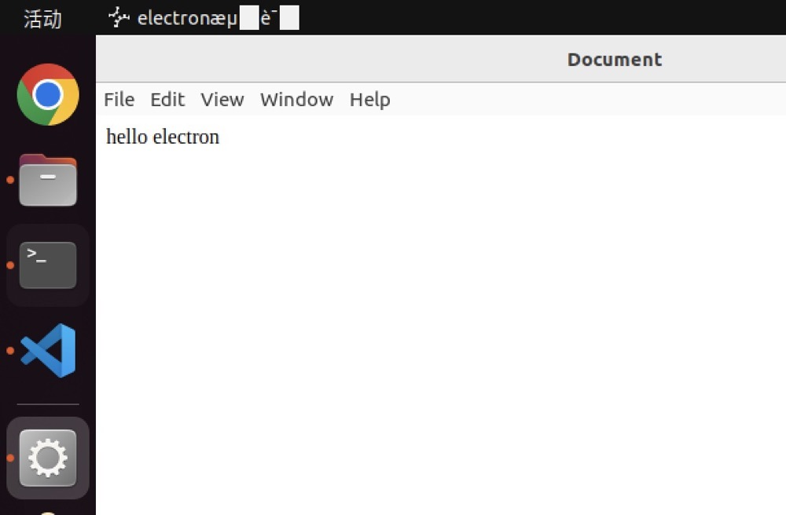

# Linux 打包适配

分享者：齐云江

---

# WHY

Linux 桌面操作系统的用户越来越多，一部分是使用 Debian、Ubuntu 的开发者、科研人员、爱好者等；另一部分是使用麒麟 OS 和 UOS 这些国产操作系统的党政、国防等领域的用户。支持 Linux 系统可以扩大用户群并提升我们的影响力。

云笔记使用 Electron 开发，支持 Linux 打包，可以直接复用现有的代码，进行简单的适配即可。

---

# deb 打包

electron-builder --linux deb

---



---


---

# 自动升级

1. electron-updater 只支持 AppImage 的自动升级；[why？](https://stackoverflow.com/a/38137655)
2. 自主开发脚本生成 deb 包的 latest-linux.yml；[e.g.](https://g.hz.netease.com/cowork/web/ynote/ynote-desktop/-/blob/develop/scripts/updateinfo-deb.js)
3. 模仿 electron-updater 自主开发 linux-updater，由于很难适配统一所有系统的升级方式，所以只做检查更新，引导到官网下载页，让用户手动卸载重装，整合到自动升级流程；[e.g.](https://g.hz.netease.com/cowork/web/ynote/ynote-desktop/-/blob/develop/src/shared/linux-updater.ts)

---

# arm64 适配

1. fpm 问题 [issue](https://github.com/electron-userland/electron-builder/issues/5154)

```
sudo apt-get install ruby-full
sudo gem install fpm
```

```
USE_SYSTEM_FPM=true electron-builder --arm64 --linux deb
```

2. UOS 打包 [how?](https://www.vvave.net/archives/how-to-build-a-debian-series-distros-installation-package.html)

```
sudo apt install dh-make fakeroot build-essential
```

编写自动化脚本：[e.g.](https://g.hz.netease.com/cowork/web/ynote/ynote-desktop/-/blob/develop/scripts/rebuild-uos.js)

```
USE_SYSTEM_FPM=true electron-builder --dir --arm64 --linux
node scripts/rebuild-uos.js
```

---

# 其他

1. npm 权限问题

```
npm set unsafe-perm true
```

2. electron 镜像加速

```
export ELECTRON_MIRROR=https://npmmirror.com/mirrors/electron/
export ELECTRON_BUILDER_BINARIES_MIRROR=https://npmmirror.com/mirrors/electron-builder-binaries/
```

3. arm64 麒麟 OS 安装后，创建快捷方式，图标不显示

```
"desktop": { Icon: "/opt/有道云笔记/resources/build/icon.svg" }
```

4. Running as root without --no-sandbox is not supported [issue](https://stackoverflow.com/a/60471688)

```
"executableArgs": [ "--no-sandbox" ]
```

<!-- --- -->

<!-- # 总结

Electron 打包过程中还遇到过很多很多的问题，通过不断去 Google、去 Github 上搜 issue，看源码，冷静分析和耐心尝试之后，一定可以找到那个最适合的答案。 -->

---

# THANKS
